# Notes
This is where rough ideas like the Intra-Node Message spec, API endpoints, and flows will live.

**Table of Contents:**  
* [Intra-Node Message Definitions](#intra-node-message-definitions):
  * [Message](#message)
  * [Command](#command)
    * [Command: get-node-connection](#command-get-node-connection)
    * [Command: get-connection-token](#command-get-connection-token)
    * [Command: list-nodes](#command-list-nodes)
    * [Command: list-channels](#command-list-channels)
    * [Command: list-reserved-channels](#command-list-reserved-channels)
    * [Command: reserve-channel](#command-reserve-channel)
    * [Command: unreserve-channel](#command-unreserve-channel)
    * [Command: node-stats](#command-node-stats)
    * [Command: host-stats](#command-host-stats)
    * [Command: get-latency](#command-get-latency)
* [API Endpoints](#api-endpoints):
  * [WS /connect](#ws-connect)
  * [WS /node](#ws-node)
  * [GET /health](#get-health)
* [Flows](#flows)
  * [Flow: New Client Single Node](#flow-new-client-single-node)
  * [Flow: New Client Multi Node](#flow-new-client-multi-node)
  * [Flow: Node Onboarding](#flow-node-onboarding)
  * [Flow: Remote Connection](#flow-remote-connection)

# Intra-Node Message Definitions
The following JSON blurbs are definitions of intra-node messages (INM).  
The top level packet contains a source, a destination, a nonce, and a message type.  
The source is used for a "return to sender" system, the destination is the target node,
and the type is what kind of message it is.

The following types are:
* `message`
* `command`
* `response`

The top level packet has the following structure:
```json
{
  "source": string, // Name of a node
  "destination": string, // ^^, or "*" for every node to process
  "type": string, // message, command, response
  "nonce": string, // Randomly generated strings
  "data": any // Usually a dictionary, but can be anything.
}
```
---
## Message

Messages with type `message` are to propagate client messages across the network.  
A typical `message` packet will look like the following:
```json
{
  "source": "node-1",
  "destination": "*",
  "type": "message",
  "nonce": "some randomly generated data",
  "data": {
    "message": "base64 encoded message data",
    "channel": "channel name here"
  }
}
```
Every node would receive, propagate, and then relay this to applicable clients.

--
## Command
Messages with type `command` are to directly control nodes themselves, and have specific command definitions (See below).  
Messages with type `response` are sent after a node processes a command, and are sent back to the command source.
Response messages also include an `ok` key in the `data`.

**For brevity, command definitions do not include `source`, `destination`, `type`, or `nonce`. The first json block is the `comand`, the second is the `response`.**  
**For brevity, response definitions that only have a Successful response will not include the `ok` key.**

---
### Command: `get-node-connection`
This command will instruct a node to acquire the host and connection token for a specified node.  
This is only intended for nodes that are directly connected.
If a node is not connected directly to the requested node, it will send back a failure message.

>Refer to flow "remote connection" for flowchart example.  

**Command**
```json
{
  "data": {
    "command": "get-node-connection",
    "node": "node-3"
  }
}
```
**Successful Response**
```json
{
  "data": {
    "ok": true,
    "host": "wss://node3.example.com/",
    "token": "connection token"
  }
}
```
**Failure Response: Node Not Connected**
```json
{
  "data": {
    "ok": false,
    "reason": "target not connected"
  }
}
```
---
### Command: `get-connection-token`
This command will request a connection token from a node.  
The target node will receive the host name of the requesting node (In the example, "node-1").  
It will then generate a token that only works for "node-1", and send it back.

>Refer to flow "remote connection" for flowchart example.  

**Command**
```json
{
  "data": {
    "command": "get-connection-token",
    "node": "node-1"
  }
}
```
**Successful Response**
```json
{
  "data": {
    "token": "connection token"
  }
}
```
---
### Command: `list-nodes`
This command will request a list of directly connected peers of the node.  
>Refer to flow "remote connection" for flowchart example.  

**Command**
```json
{
  "data": {
    "command": "list-nodes"
  }
}
```
**Successful Response**
```json
{
  "data": {
    "nodes": ["node-3", "node-4"]
  }
}
```
---
### Command: `list-channels`
This command will request a list of open channels on the node.  
Importantly, this does not include *reserved* channels. Reserved channels
are stored in a separate list, which can be accessed from the [list-reserved-channels](#command-list-reserved-channels) command.  
>Refer to flow "node onboarding" for flowchart example.

**Command**
```json
{
  "data": {
    "command": "list-channels"
  }
}
```
**Successful Response**
```json
{
  "data": {
    "channels": [
      {
        "name": "channel1",
        "password": "sha256hash"
      },
      {
        "name": "channel2",
        "password": "sha256hash"
      }
    ]
  }
}
```
---
### Command: `list-reserved-channels`
This command will request a list of reserved channels on the node.  
This is used for onboarding a new node for the channels that are already open on the network, including their hashed password.  
Passwords are hashed with SHA-256, with the salt being the channel name, 32768 iterations.  
The master node will have a routine to ask all nodes for their reserved channels, and if a node is out of sync with the network, will either add or remove reserved channels to synchronize the network.

>Refer to flow "node onboarding" for flowchart example.

**Command**
```json
{
  "data": {
    "command": "list-reserved-channels"
  }
}
```
**Successful Response**
```json
{
  "data": {
    "channels": [
      {
        "name": "channel1",
        "password": "sha256hash"
      },
      {
        "name": "channel2",
        "password": "sha256hash"
      }
    ]
  }
}
```
---
### Command: `reserve-channel`
This command is used when a new channel is opened, and the network needs to be informed it is no longer available.  

>Refer to flow [new client, multi node](#flow-new-client-multi-node) for flowchart example.

**Command**
```json
{
  "data": {
    "command": "reserve-channel",
    "channel": "channel3",
    "password": "sha256hash"
  }
}
```
**Successful Response**
```json
{
  "data": {
    "ok": true
  }
}
```
**Failure Response: Channel Already Reserved**
```json
{
  "data": {
    "ok": false,
    "reason": "channel already reserved"
  }
}
```  
---
### Command: `unreserve-channel`
The opposite of [`reserve-channel`](#command-reserve-channel), used when a channel is freed.  
When a node closes a channel, it will ask the rest of the network if they have any open, and if no node on the network has active clients, it will unreserve the channel and make it available again.

**Command**
```json
{
  "data": {
    "command": "unreserve-channel",
    "channel": "channel3"
  }
}
```
**Successful Response**
```json
{
  "data": {
    "ok": true
  }
}
```
**Failure Response: Channel Still Open**
```json
{
  "data": {
    "ok": false,
    "reason": "channel still open"
  }
}
```
> In this failure state, the node that was trying to unreserve the channel should send a new [`reserve-channel`](#command-reserve-channel) as soon as possible, to try to prevent network fragmentation.

---
### Command: `node-stats`
This command will gather information about the WSRelay node, such as the channels, clients, and general health.  
The master node will use this information for keeping longer node histories, as nodes will only keep 60 seconds of data to keep memory usage low.

**Command**
```json
{
  "data": {
    "command": "node-stats"
  }
}
```
**Successful Response**
```json
{
  "data": {
    "relay": { // General overview of connections
      "channels": ["channel1","channel2"],
      "clients": 5,
      "channel_connections": {
        "channel1": 3,
        "channel2": 3 // In this case, it would mean that 1 client is connected to both channels.
      }
    },
    "network": { // Aggregate channel statistics
      "packets": {
        "1s": 2,
        "15s": 30,
        "60s": 63
      },
      "bandwidth": { // Average bandwidth in kb/s
        "1s": 1.3,
        "15s": 41.2,
        "60s": 124.6
      }
    },
    "channels": { // Channel specific network information
      "channel1": {
        // Network dictionary here
      },
      "channel2": {
        // Network dictionary here
      }
    }
  }
}
```
---
### Command: `host-stats`
This command will gather statistics of the host itself, such as CPU, RAM, Disk, and Networking.  
This is intended for the master node, to display in the Network Overview, as this otherwise has no use case purely in the node network.

**Command**
```json
{
  "data": {
    "command": "host-stats"
  }
}
```
**Successful Response**
```json
{
  "data": {
    "cpu": { // These will be the unix 
      "1m": 0.00,
      "5m": 0.00,
      "15m": 0.00
    },
    "mem": {
      "used": 1000, // psutil mem.used
      "free": 500, // psutil mem.free
      "cache": 500, // psutil mem.available
      "total": 2000 // psutil mem.total
    },
    "disk": [ // List of all the mounted disks, and their usage.
      {
        "mount": "/",
        "used": 0,
        "free": 1000,
        "total": 1000
      }
    ],
    "network": { // This is collected every 15 seconds, and only 4 entries are kept.
      "bytes": {
        "15s_in": 100,
        "15s_out": 200,
        "30s_in": 200,
        "30s_out": 400,
        "45s_in": 800,
        "45s_out": 1600,
        "60s_in": 3200,
        "60s_out": 6400
      },
      "packets": {
        // Same as bytes, just with packets instead.
      }
    }
  }
}
```
---
### Command `get-latency`
This command is used to determine latency between a pair of nodes.  
This can be used to build the fast router table, or just as statistics for the network.

**Command**
```json
{
  "data": {
    "command": "get-latency",
    "node": "node-2"
  }
}
```
**Successful Response**:
```json
{
  "data": {
    "ok": true,
    "latency": 0.45 // Milliseconds
  }
}
```
**Failure Response: Node Not Connected**
```json
{
  "data": {
    "ok": false,
    "reason": "target not connected"
  }
}
```

## API Endpoints
Each node should implement these API endpoints, both for INMs, and normal clients to connect to.

### WS /connect
This websocket endpoint is what clients will connect to, to access the relay network.

The optional `nonce` parameter can help with keeping track of what commands and responses are together.

Clients will send messages with a command, and a message if necessary.
>Look at flows [new client, single node](#flow-new-client-single-node), [new client, multi node](#flow-new-client-multi-node) for extra clarification.
#### Subscribe to Channel
```json
{
  "command": "subscribe",
  "data": {
    "topic": "channel1",
    "password": "wordpass" // Not required
  },
  "nonce": "abc123"
}
```
**Successful Response**
```json
{
  "type": "response",
  "data": {
    "ok": true
  },
  "nonce": "abc123"
}
**Failure Response: Invalid Password**
```json
{
  "type": "response",
  "data": {
    "ok": false,
    "reason": "invalid password"
  },
  "nonce": "abc123"
}
```
#### Unsubscribe from Channel
```json
{
  "command": "unsubscribe",
  "data": {
    "topic": "channel1"
  },
  "nonce": "abc123"
}
```
**Successful Response**
```json
{
  "type": "response",
  "data": {
    "ok": true
  },
  "nonce": "abc123"
}
#### List Channels
```json
{
  "command": "list",
  "data": {},
  "nonce": "abc123"
}
```
**Successful Response**
```json
{
  "type": "response",
  "data": {
    "channels": ["channel1","channel2"]
  },
  "nonce": "abc123"
}
```
#### Send Message
Clients must be subscribed to the channel to send messages.
```json
{
  "command": "send",
  "data": {
    "message": "Hello",
    "channel": "channel1"
  },
  "nonce": "abc123"
}
```
**Successful Response**
```json
{
  "type": "response",
  "data": {
    "ok": true
  },
  "nonce": "abc123"
}
#### Receive Message
This isn't a message that a client would send; rather what they receive when a message is sent to the channel.
```json
{
  "type": "message",
  "data": {
    "message": "Hello",
    "channel": "channel1"
  },
  "nonce": "abc123"
}
```

### WS /node
This endpoint is for connecting to the INM system, for node to node communication.  
The following headers are required: `Authentication`. This should be the token either hard-coded in the node config, or gotten with [Command: get-connection-token](#command-get-connection-token).  
After a node connects, the very first message it should send is a handshake consisting of the following json payload:
```json
{
  "command": "handshake",
  "data": {
    "name": "node3"
  }
}
```
If the receiving node can not authenticate the name and token together, it will close the websocket with an HTTP403.

### GET /health
A simple endpoint that returns the following json packet:
```json
{
  "healthy": "good",
  "reason": "healthy"
}
```
The `healthy` key has the following states: `good`, `degraded`, `bad`.  
Degraded can happen for the following reason:
* `no peers`: The node has no other nodes peer'd to it with the INM system, which usually means it has become disconnected from the larger network, and should be investigated. However, it can still function as a relay, just individual.
An important side note is that if the node has no designated peers in the config, this will be disabled.
* `clients no channels`: The node has more than 3 clients connected, but has no channels open. This could be an indication of a logic error, or weird client behaviour.
* `high latency`: One of the node's peers has high latency (>10ms), which could be an indication of network issues.

Bad can happen for the following reason:
* `channels no clients`: The node has no clients, but open channels. This is a serious logic error, and the node should be restarted.

# Flows
These are example flows to demonstrate how the network should function under normal conditions.

## Flow: New Client (Single Node)
This flow assumes that Client 1 has already connected, and subscribed to the channel.


## Flow: New Client (Multi Node)
This flow assumes that both clients are already connected.


## Flow: Node Onboarding
This flow demonstrates adding a new node to an existing network.  
In the example, Node A has an open channel "channel", and Node B has it in reserve.  
In the example, Node C has it's node -> node pool exhausted, so it will not initiate a direct connection to Node A. For an example of direct connection, refer to flow [Remote Connection](#flow-remote-connection).

```mermaid
sequenceDiagram
  participant na as Node A
  participant nb as Node B
  participant nc as Node C

  Note left of na: Node A has<br>"channel" open.
  Note left of nb: Node B has<br>"channel" reserved.
  nc->>nb: WS /node
  Note right of nc: The token is the hardcoded<br>one in Node B config.
  nc->>nb: Handshake<br>Node C
  Note right of nc: At this stage, Node C needs to<br>synchronize with the rest<br>of the network.
  Note right of nc: Any open channels will get<br>reserved on Node C.
  nc->>nb: get open channels
  nb->>nc: []
  Note right of nc: Any reserved channels will be<br>reserved on Node C.
  nc->>nb: get reserved channels
  nb->>nc: ["channel"]
  Note over na,nc: At this stage, the entire network should be synchronized<br>in terms of open and reserved channels. 
```



## Flow: Remote Connection
This flow demonstrates adding a node to an existing network.  
In the example, Node C has space in its node -> node pool, so it will try to initiate a connection to Node A.  

In the example, Node A has "channel" open, and Node B has "channel" reserved.
